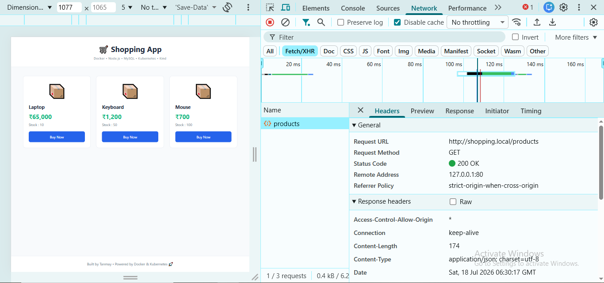
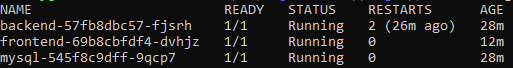
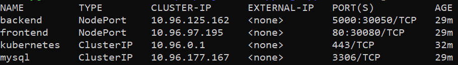
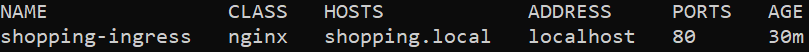
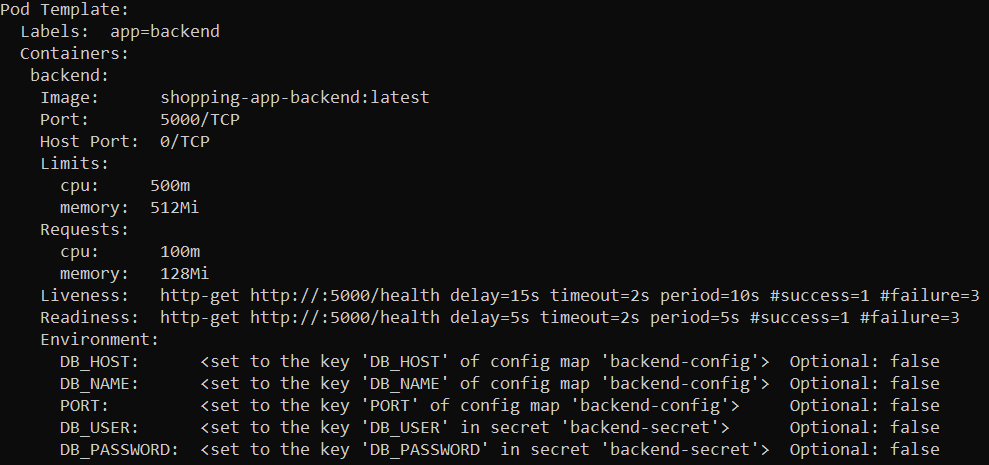
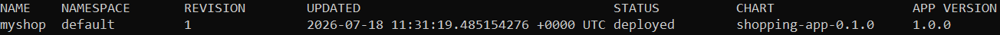

# 🛒 Shopping App


> A production-oriented DevOps project demonstrating containerization,
> Kubernetes orchestration, and Helm-based application deployment.

A full-stack **3-tier Shopping Application** built with **Node.js,
MySQL, Docker, Kubernetes, and Helm**.

The project demonstrates modern cloud-native application deployment by
containerizing a full-stack application, orchestrating it with
Kubernetes, packaging deployments using Helm, managing configuration
securely with ConfigMaps and Secrets, persisting data using Persistent
Volumes, exposing services through an NGINX Ingress Controller, and
following production-oriented deployment practices.

------------------------------------------------------------------------

# 🚀 Tech Stack

-   HTML5
-   CSS3
-   JavaScript (Vanilla)
-   Node.js
-   Express.js
-   MySQL
-   Docker
-   Docker Compose
-   Kubernetes
-   Helm
-   Kind
-   NGINX Ingress Controller

------------------------------------------------------------------------

# ✨ Features

-   🛒 Display products from MySQL
-   REST API using Express.js
-   Dockerized frontend and backend
-   Kubernetes Deployments
-   Kubernetes Services
-   ConfigMaps
-   Secrets
-   Persistent Volumes (PV)
-   Persistent Volume Claims (PVC)
-   Readiness Probe
-   Liveness Probe
-   Resource Requests & Limits
-   NGINX Ingress Controller
-   Custom Domain (`shopping.local`)
-   Automatic Pod Recovery
-   Persistent MySQL Storage
-   Helm Charts
-   Helm-based Deployment & Release Management

------------------------------------------------------------------------

# 📐 Architecture

``` text
                           Browser
                               │
                        shopping.local
                               │
                   NGINX Ingress Controller
                               │
                     Frontend Service
                               │
                  Frontend Deployment
                               │
                     Frontend Pods
                               │
                      Backend Service
                               │
                  Backend Deployment
                               │
                      Backend Pods
                               │
                  ConfigMap + Secret
                               │
                      MySQL Service
                               │
                   MySQL Deployment
                               │
                        MySQL Pod
                               │
                  PersistentVolumeClaim
                               │
                    Persistent Volume
```

------------------------------------------------------------------------

# 📂 Project Structure

``` text
shopping-app/
├── backend/
├── frontend/
├── mysql/
├── k8s/
├── shopping-chart/
├── kind-config.yaml
├── docker-compose.yml
└── README.md
```

------------------------------------------------------------------------

# 🚀 Getting Started

## Clone

``` bash
git clone <YOUR_REPOSITORY_URL>
cd shopping-app
```

## Docker

``` bash
docker compose up --build
```

## Kubernetes

``` bash
kubectl apply -f k8s/
```

## Helm

``` bash
helm install myshop ./shopping-chart
```

------------------------------------------------------------------------

# 📸 Screenshots

## 🛒 Shopping Application

The application running through **NGINX Ingress** using the custom
domain `shopping.local`.



------------------------------------------------------------------------

## ☸️ Kubernetes Pods

All application Pods running successfully.



------------------------------------------------------------------------

## 🌐 Kubernetes Services

Internal Services exposing the frontend, backend, and MySQL.



------------------------------------------------------------------------

## 🚪 NGINX Ingress

Ingress routing traffic from `shopping.local`.



------------------------------------------------------------------------

## ⚙️ Backend Deployment

Configured with ConfigMaps, Secrets, Liveness & Readiness Probes and
Resource Limits.



------------------------------------------------------------------------

## 🐳 Docker Containers

Application running with Docker Compose.


------------------------------------------------------------------------

## 📦 Docker API Response

Backend API returning product data.


------------------------------------------------------------------------

## 📁 Project Structure


------------------------------------------------------------------------

## 🏠 Docker Home

Application running with Docker Compose.


------------------------------------------------------------------------

## ⎈ Helm Release

Successful Helm deployment.



------------------------------------------------------------------------

# 🛠 Kubernetes Features Implemented

-   ✅ Deployments
-   ✅ ReplicaSets
-   ✅ Pods
-   ✅ Services
-   ✅ ConfigMaps
-   ✅ Secrets
-   ✅ Persistent Volumes
-   ✅ Persistent Volume Claims
-   ✅ Liveness Probes
-   ✅ Readiness Probes
-   ✅ Resource Requests
-   ✅ Resource Limits
-   ✅ NGINX Ingress
-   ✅ Custom Domain
-   ✅ Helm Chart
-   ✅ Helm Release Management

------------------------------------------------------------------------

# ⎈ Helm Deployment

``` bash
helm lint ./shopping-chart
helm template myshop ./shopping-chart
helm install myshop ./shopping-chart
helm list
helm status myshop
helm upgrade myshop ./shopping-chart
helm rollback myshop <REVISION_NUMBER>
helm uninstall myshop
```

------------------------------------------------------------------------

# 🌐 Access

**Frontend**

``` text
http://shopping.local
```

**Health**

``` text
http://shopping.local/health
```

**Products API**

``` text
http://shopping.local/products
```

------------------------------------------------------------------------

# 📚 Learning Outcomes

-   Docker containerization
-   Kubernetes orchestration
-   Service discovery
-   Persistent storage
-   ConfigMaps & Secrets
-   Health monitoring
-   Resource management
-   Ingress routing
-   Helm chart creation
-   Helm release management
-   Helm templating
-   Kubernetes troubleshooting
-   Production-oriented deployment practices

------------------------------------------------------------------------

## 👨‍💻 Author

**Tanmay Khatri**

Built with ❤️ using Docker, Kubernetes, and Helm 🚀

