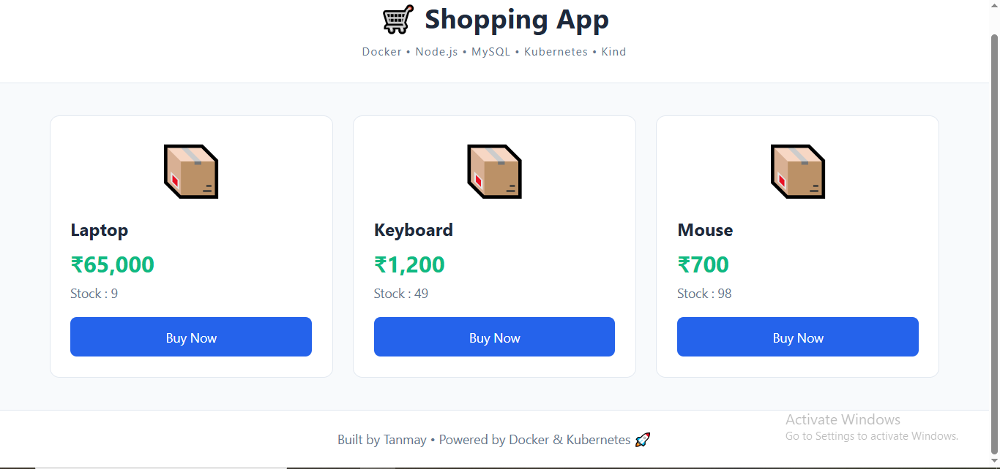
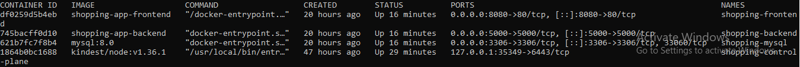
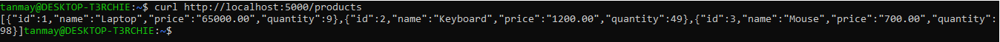
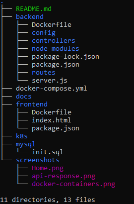

# 🛒 Shopping App

A full-stack shopping application built using **Node.js**, **Express.js**, **MySQL**, **Docker**, and **Docker Compose**.

---

## 🚀 Features

- View available products
- Purchase products
- Automatic stock updates
- RESTful API
- Dockerized deployment
- MySQL database integration
- Responsive frontend
- Dockerized 3-tier shopping application
- Kubernetes Deployments and Services
- ConfigMaps for application configuration
- Secrets for sensitive credentials
- Persistent Volumes and Persistent Volume Claims
- Liveness and Readiness Probes
- MySQL persistence across Pod restarts

---

## 🛠️ Tech Stack

- HTML
- CSS
- JavaScript
- Node.js
- Express.js
- MySQL
- Docker
- Docker Compose
- Git & GitHub

---

## 📂 Project Structure

```
shopping-app/
│
├── backend/
│   ├── config/
│   ├── controllers/
│   ├── routes/
│   ├── server.js
│   └── package.json
│
├── frontend/
│   └── index.html
│
├── mysql/
│   └── init.sql
│
├── docker-compose.yml
└── README.md
```

---

## ▶️ Run the Project

Clone the repository

```bash
git clone https://github.com/tanmaykexe/shopping-app.git
```

Go into the project

```bash
cd shopping-app
```

Start the application

```bash
docker compose up --build -d
```

---

## 🌐 Access

Frontend

```
http://localhost:8080
```

Backend API

```
http://localhost:5000/products
```

Health Check

```
http://localhost:5000/health
```

---

## 📸 Application

### 🛍️ Home Page



---

### 🐳 Docker Containers



---

### 🔌 Backend API Response



---

### 📁 Project Structure



---

## 👨‍💻 Author

**Tanmay Khatri**

Learning DevOps through practical projects.
